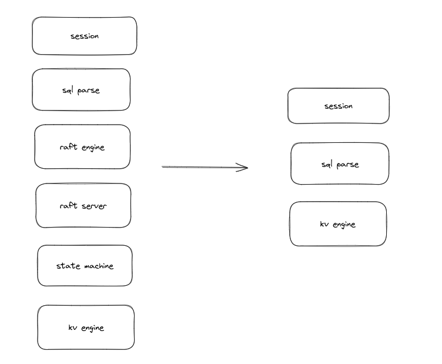

# 写在前面

这里只作为一个计划大纲，记录一下应该做什么，将db制作分为几个大部分，每个部分制作详情，包括涉及知识点，放在docs下其他md文件中。

# 整体

首先确定一下我想要什么
- 关系型数据库
- 分布式
- 支持mvcc

说一下大体流程 sql 进入之后 首先进行解析，解析成为一个抽象语法树，
然后通过语法树转换成为一个个算子（node），之后对算子进行优化。
算子最终就是一颗执行树，从最低层开始往上执行。
+ TODO: 语法树的样子 <25-03-23, bk> +
+ TODO: 算子最终形态 <25-03-23 bk> +

执行树其实相当于命令(command)了,之后通过raft进行多节点一致性保障.

leader在确定命令被大部分节点接受后进行commit,此时才调用状态机应用（apply）命令。

状态机就是底层存储的封装，又或者说是对真正的db的封装.
图中kv engine才是真正的db.其中涉及到执行树的执行，mvcc实现细节。

一开始最好是建立一个单机的db,因此我们将raft实现删除，保留其余。

为了后续raft实现能够无缝接入，这里需要保障raft engine和kv engine实现同一个trait, 
这也是为什么需要raft engine, 相当于proxy,做一层兼容。所有的命令都会汇集到leader,之后利用kv engine执行。

> 明确 raft engine一切都是proxy,它不会做任何数据库相关的操作

因为事务概念其实从session中就有所感知，所以raft engine, kv engine 都需要有事务支持，
raft engine 和 kv engine 的事务支持 都相当于proxy, 只有kv engine在底层进行mvcc事务调用。

> 为什么要这样做？ 因为kv 与 raft engine对外需要一个统一的抽象，而且必须有事务支持
而raft engine只是proxy ***它不会做任何数据库相关的操作*** 目前的想法中它其实就是raft client,负责消息的接收，返回响应。
所以kv,raft engine 都需要实现一个事务抽象。

# 目的
学习rust+数据库。这两个属于目前有点了解，但是没有真正接触的领域，希望通过此项目学习更多吧。本docs会记录下学习或者设计过程。
***此项目大部分设计来自于[toydb](https://github.com/erikgrinaker/toydb)***
> **toyDB is not suitable for real-world use, but may be of interest to others learning about database internals.**

作为一个"玩具"数据库，真的很适合学习。唯一的缺点是没有实现数据的文件存储,都是内存，每次数据启动都会读取raft log然后进行重放读入到内存中，有余力的话会尝试进行B+tree作为本地数据存储的方案。

# 目录

记录每个过程
- [parse](parse.md)

