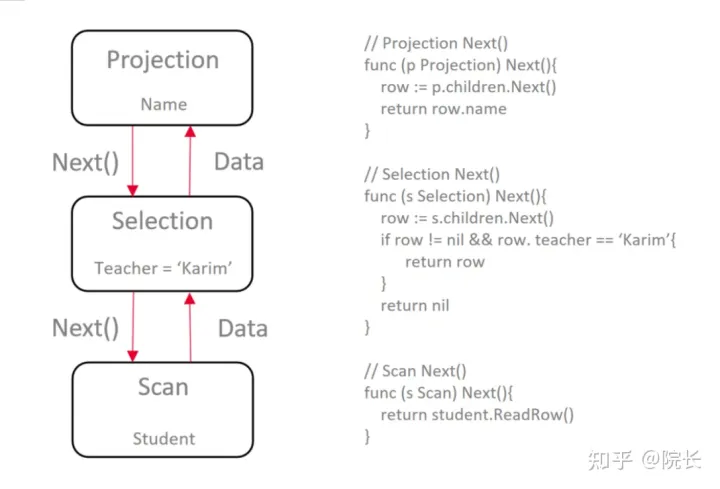
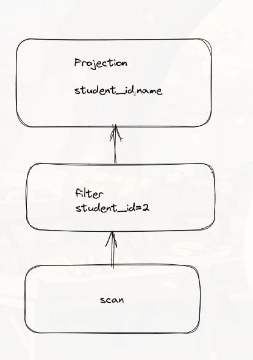
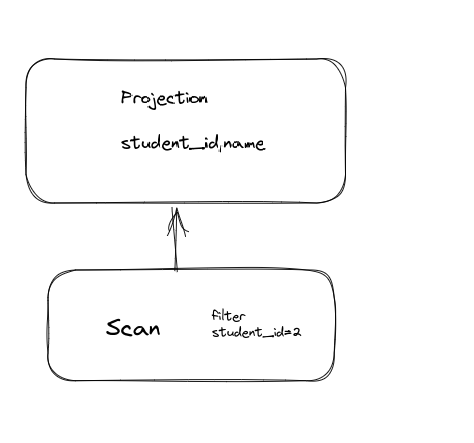
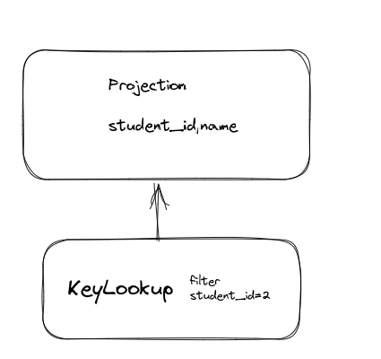
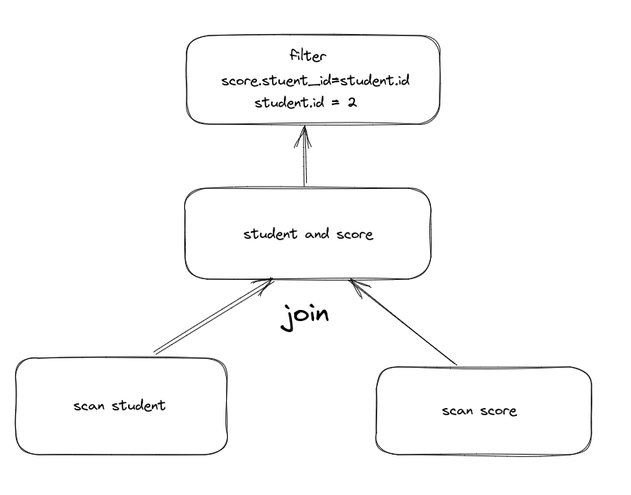

# 知识储备
可以在网上搜一下火山模型，我是看完源码之后才知道这就是火山模型，对语法进行解析之后会生成一颗语法树。
我们需要将语法树转化成为执行树。将每一个操作抽象成为一个独立的操作（算子）.

在上图我们先进行scan操作（这是最底层的操作,将数据拿出来）,
然后进行selection操作（条件过滤）,之后进行projection操作（投影,过滤不需要的数据,只将用户关注的数据展示）

我们将需要的操作一共分为以下几个操作
- insert
- update
- delete
- createTable
- dropTable -- 上面都是比较简单的操作一看就懂,下面涉及到查询的操作就比较复杂了
- scan 上面也说过就是最底层拿数据的操作（也可以进行filter操作）
- filter 条件过滤（对应上图中的selection）
- Projection 投影 指定获取结果集中的列，或者对结果列进行重命名
- Limit 限制数据结果数目
- Offset 指定需要的数据从结果集中第几条数据开始
- Order 排序操作
- Aggregation 聚合操作（这里涉及到groupby和聚合函数处理）
- NestedLoopJoin 表连接

以上是从语法树到初始执行树的组成部分。scan和filter都有过滤行为，但是filter是对结果进行过滤
比如sum(age) > 180, 这种扫描一行结果是无法过滤的，这就需要filter出马了，当然where开始会被组装成为filter.
那后来变成什么？那就涉及到优化了。

这里进行以下优化，并会生成一些新的操作
- HashJoin 将其中一个表作为散列集，与另一个表进行连接 比如user.id=stu.user_id 此时可以选择一个表的id做成散列集 然后另一表只需要在散列集中迅速查找即可
- IndexLookup 看到一个查询条件涉及到主键，则进行主键扫描
- KeyLookup 看到一个查询条件涉及到索引，则先进行索引扫描

select name,id from student where student_id=2
这个sql中开始的执行树是这样的

这个时候就可以将filter进行下推，在底层拿取数据的时候就可以进行过滤。

student_id其实是一个索引或者主键，这个时候就不需要全表扫描了，直接走索引不就好了

这个谓词下推在单表查询时可能看不到效果 如果是多表连接 效果就比较显著了

SELECT * FROM student, score
WHERE score.student_id=student.student_id
AND score.score_id=2;

下推之后的结果可能是这样

student.id=score.student_id 同时 student.id=2不就等于score.studen_id=2 吗 所以在score表中也同时进行filter过滤
如果接下来还有主键，索引 还可以依照刚刚的优化继续。

# select 执行树生成
其余的执行树生成过程较为简单，所以这里就说一下select。
select执行树是比较复杂的生成过程
涉及到下面
- select字段
- where过滤
- from join
- grouby
- 聚合函数
- having
- order by
- limit
- offset

scan 就是从from中生成的 from stu join score 
此时会生成 scan stu 和 scan score 然后进行join，可以参照上面的图。

此时我们就相当于拿到了表中每一列数据了。之后再通过where解析，进行filter过滤。
开始我以为之后就直接select进行投影了(select 其实就是一个投影的过程，拿出想要的列，然后在进行列名更正)
其实我们需要先查看 having 和 orderby

